# [Murkyware™](https://murkyware.com) :: World's First Software Profiling Service

## Introduction
Ransomware Detection Tool by Murkyware™

Murkyware™ Scanner search and identify phishing documents and MITRE ATT&CK® software tools weaponized by ransomware operators to conduct reconnaissance, infiltration, lateral movement, collection, and exfilteration.

## Prerequisites
Operating System: Windows 7, Windows 8, Windows 10, Windows 11

## Installation
1. Download the latest release of Murkyware™ Scanner from the [Anti-Ransomware Page](https://murkyware.com/page/anti-ransomware)
2. Calculate and compare the SHA256 hash of the downloaded executables with the hashes below.
3. Run Murkyware™ Scanner standalone file or the setup file with or without administrative pirviliages. (Administrator account is only required if performing Network Traffic and Memory Scan). The standalone program takes approximately 50 seconds to load.

| File                 | Hash                                                              | Size     |
|:---------------------|:------------------------------------------------------------------|:---------|
| Murkyware.exe        | e20bbcde24d55bd0497aaf6af3c5e7f1b88f9efd70a87246303887123e54fc70  | 96.33 MB |
| Murkyware_Setup.exe  | ec0632be501a13879c632e50f43a0933d90f4b1260bf414209e280887a0a2c38  | 65.44 MB |

## Usage
Murkyware™ Scanner is easy to use and offers the following features:

### 1. Scan by Software Name
To search your system or network for specific software (e.g., Rclone), follow these steps:

1. Launch Murkyware™ Scanner.
2. Click on the "Scan by Software Name" tab (selected by default).
3. Choose location to scan using the "Browse" button.
4. Choose the desired Software to scan for (e.g., pCloud) from the dropdown menu.
5. Click the "Scan" button to initiate the search process.
6. Scan results will be shown once the search is complete.
7. Export the scan results by clicking on the export button.

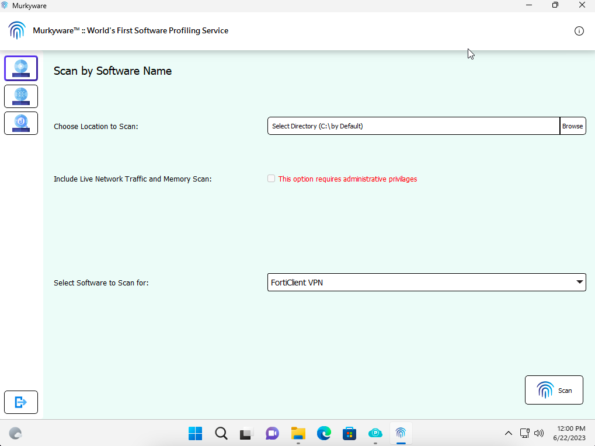
*Description: Scan by Software Name.*

*Description: Browse to Location to Scan.*

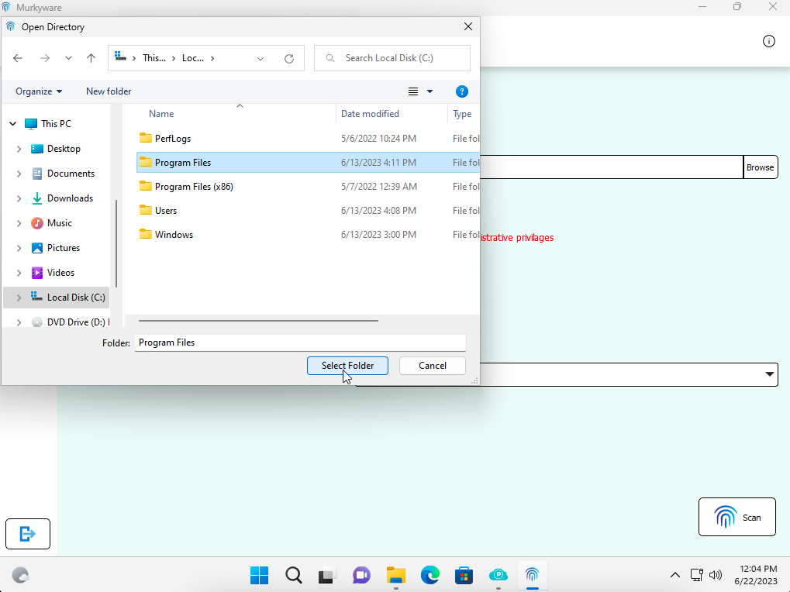
*Description: Select Location to Scan.*

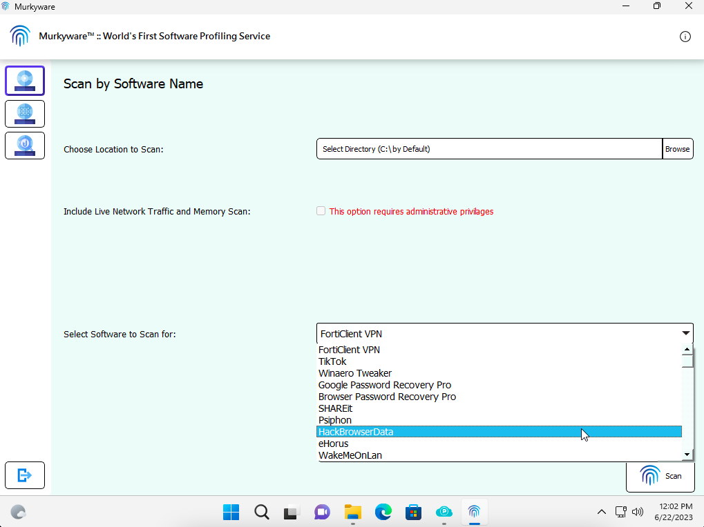
*Description: Select Software Name to Scan.*

*Description: Select Software Name to Scan.*

*Description: Scan for Software IOCs.*

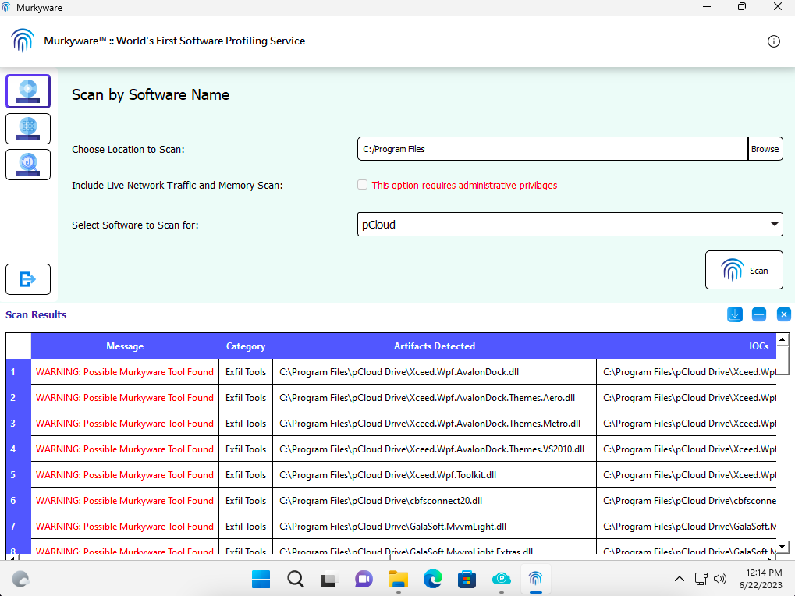
*Description: Scan Results is shown.*

*Description: Export Scan Results.*

### 2. Scan by Software Cateogry
To search your system or network for specific software category (e.g., Remote Access), follow these steps:

1. Launch Murkyware™ Scanner.
2. Click on the "Scan by Software Category" tab (selected by default).
3. Choose location to scan using the "Browse" button.
4. Select the desired Software Category to scan for (e.g., Exfil Tools) from the dropdown menu.
5. Click the "Scan" button to initiate the search process.
6. Scan results will be shown once the search is complete.
7. Export the scan results by clicking on the export button.

*Description: Scan by Software Category.*

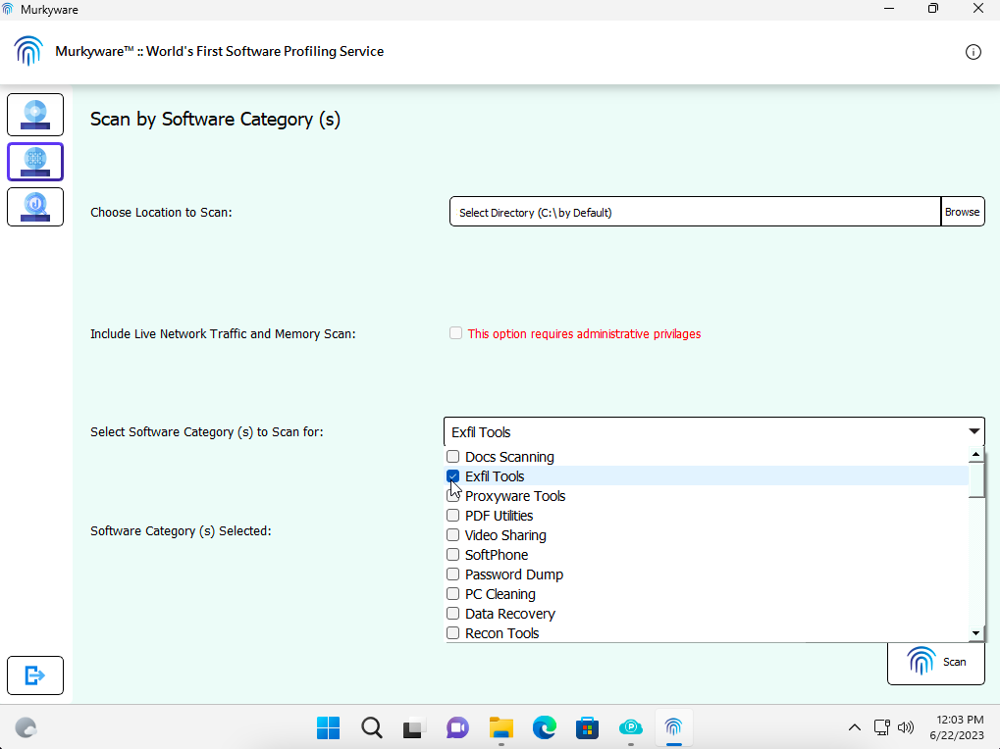
*Description: Select Software Name to Scan.*

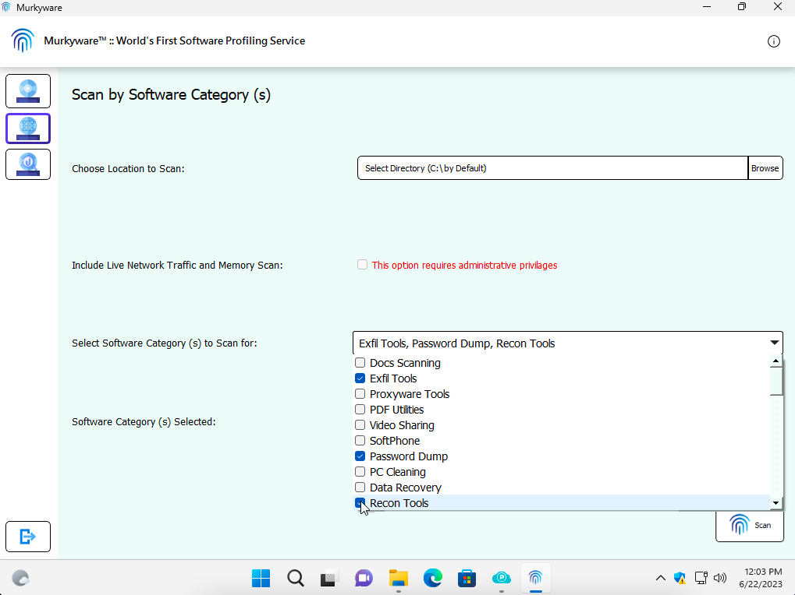
*Description: Select Software Name to Scan.*

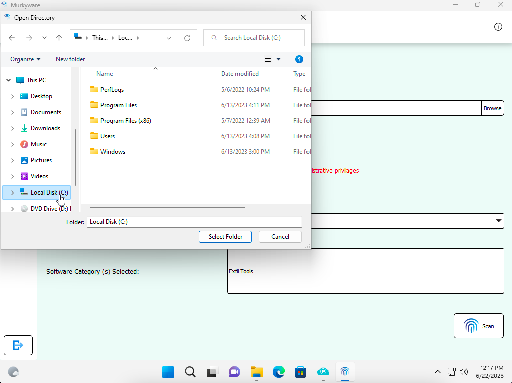
*Description: Browse to Location to Scan.*

*Description: Select Location to Scan.*

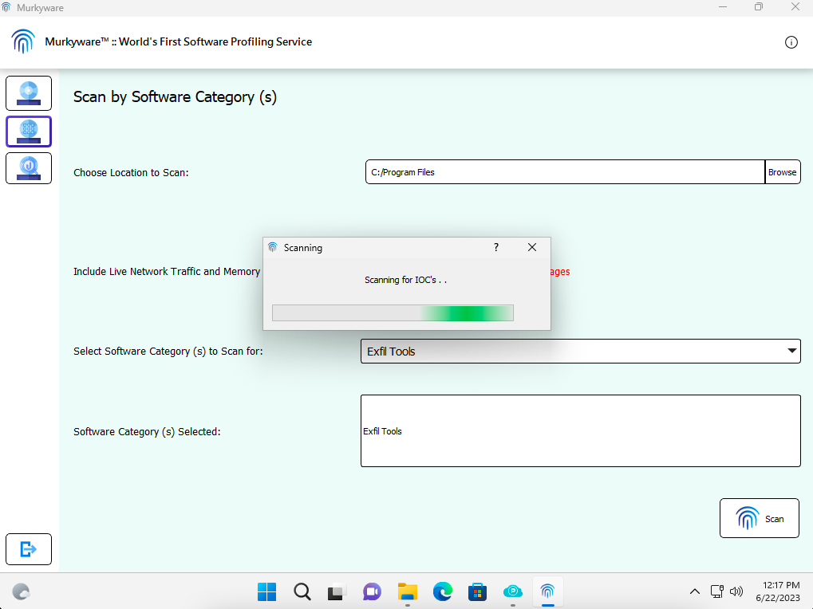
*Description: Scan for Software IOCs.*

*Description: Scan Results is shown.*

### 3. Scan by Phishing IOCs
To search your system or network for Phishing Campaigns IOCs (e.g., Emotet), follow these steps:

1. Launch Murkyware™ Scanner.
2. Click on the "Scan by Phishing IOCs" tab (selected by default).
3. Choose location to scan using the "Browse" button.
4. Select the Start Date of the Phishing Campaign (e.g., May 19, 2023) from the dropdown menu.
5. Select the End Date of the Phishing Campaign (e.g., May 19, 2023) from the dropdown menu.
6. Click the "Scan" button to initiate the search process.
7. Scan results will be shown once the search is complete.
8. Export the scan results by clicking on the export button.

*Description: Scan by Software Category.*

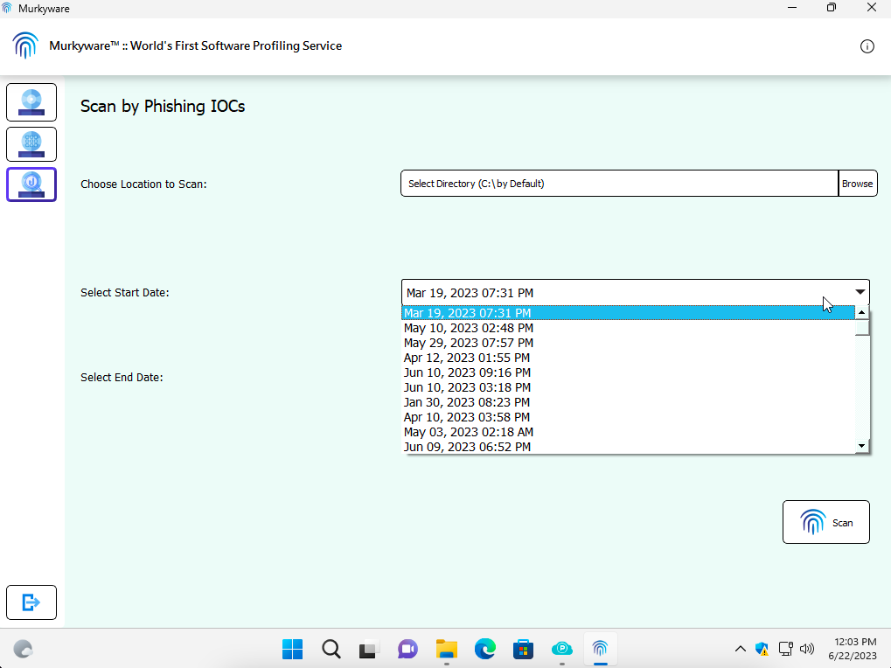
*Description: Select Software Name to Scan.*

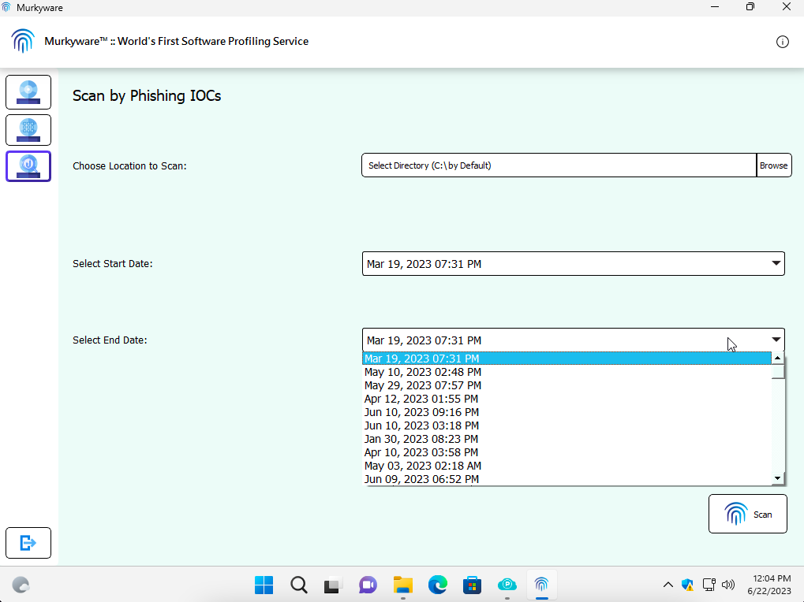
*Description: Select Software Name to Scan.*

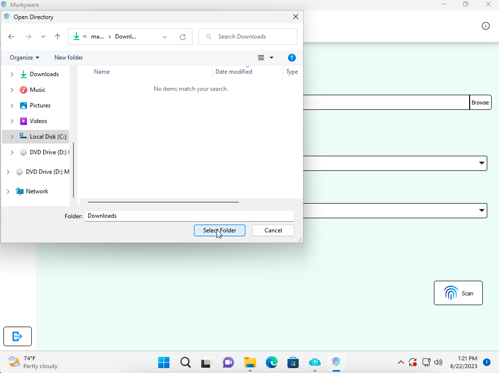
*Description: Browse to Location to Scan.*

*Description: Scan Results is shown.*

*Description: Scan Results with No IOCs Found.*

## Troubleshooting
If you encounter any issues while using Murkyware™ Scanner, try the following troubleshooting steps:
- Ensure you have the latest version of Murkyware™ Scanner (API keys change frequently).
- Check that Microsoft Windows Defender or other EDR software is not blocking Murkyware™ Scanner.
- Relaunch the software if scanning time is longer than expected.

If the problem persists, please contact our support team at contact@murkyware.com for assistance.

## Contributions
Contributions to Murkyware™ Scanner are welcome! If you find any bugs, have feature requests, or would like to contribute code improvements, please reach out to us at contact@murkyware.com to request access to the source code. We appreciate your contributions.

## License
Murkyware™ Scanner is released under the [Creative Commons Attribution-NonCommercial-NoDerivatives 4.0 International License](LICENSE.md). Please review the license file for more details.

## Acknowledgments
We would like to thank the open-source community for their valuable contributions to Murkyware™ Scanner.

## Contact
If you have any questions or feedback, feel free to reach out to us at contact@murkyware.com.
